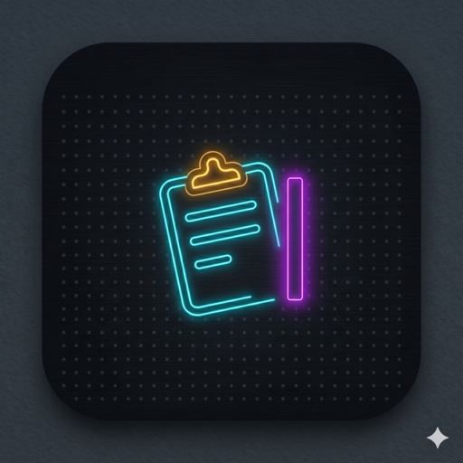
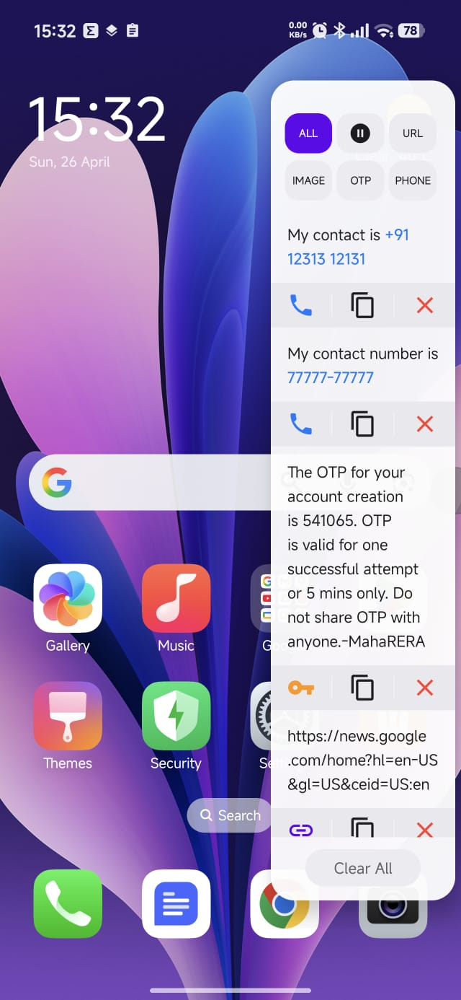
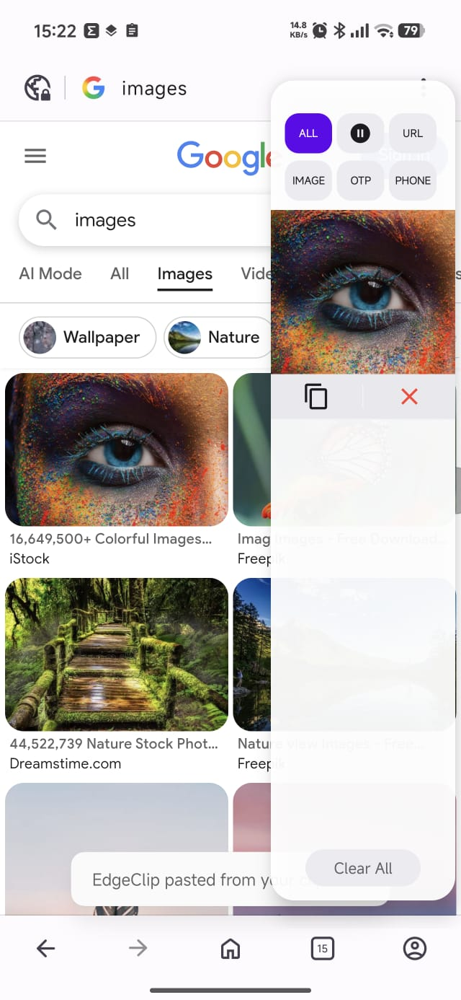
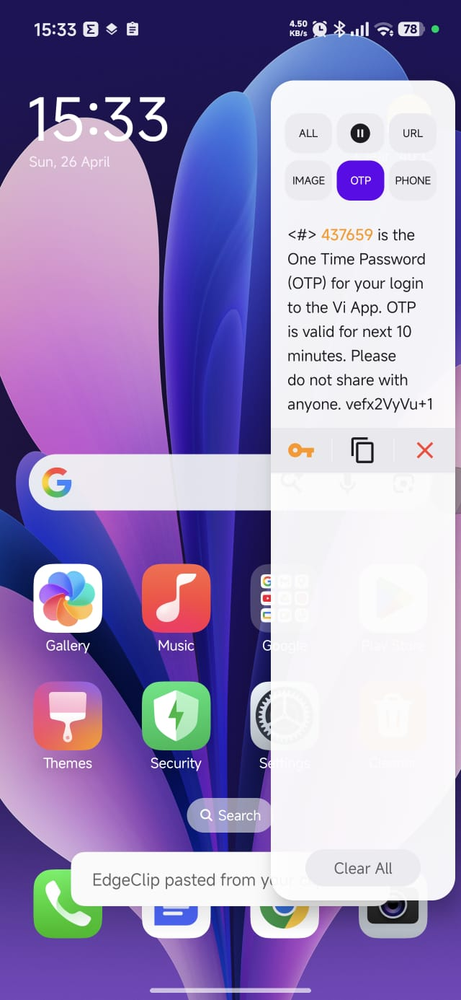
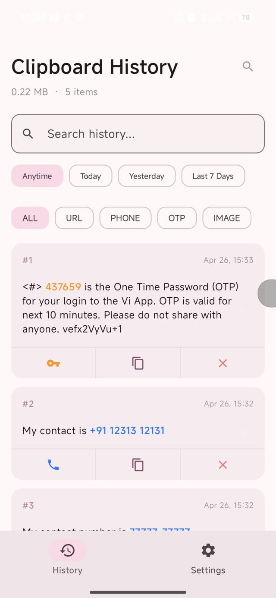
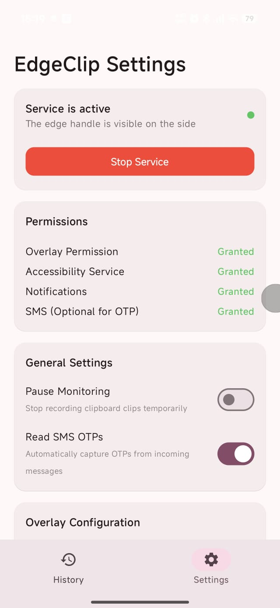
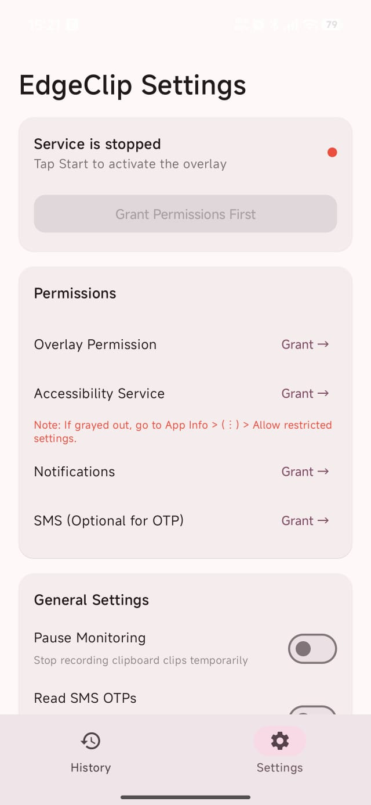
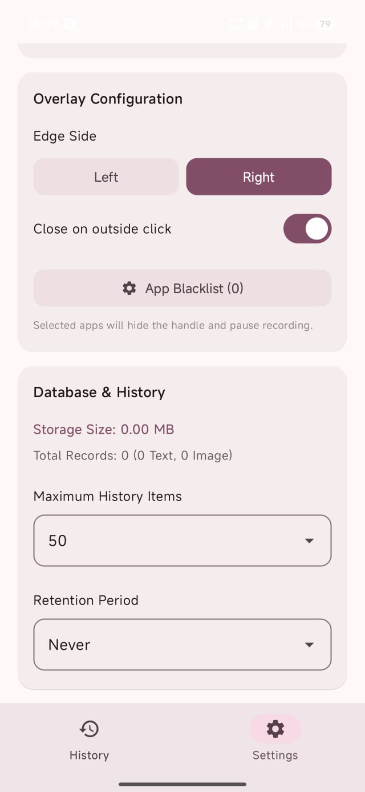
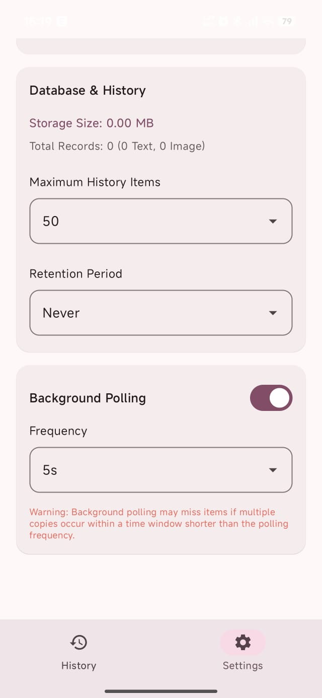

#  EdgeClip - Secure & Smart Clipboard Manager

EdgeClip is a professional-grade, privacy-focused clipboard manager for Android. It bridges the gap between productivity and security by providing instant access to clipboard history through a non-intrusive edge overlay, while ensuring all data remains locally encrypted and under the user's control.

---

## 🌟 Professional Showcase

This project demonstrates expertise in:
- **Android System Internals:** Leveraging Accessibility Services and Window Management for background clipboard access on Android 10+.
- **Security Engineering:** Implementation of SQLCipher with Android Keystore for AES-256 at-rest encryption.
- **Modern UI/UX:** A hybrid architecture using **Jetpack Compose** for configuration and **Programmatic Android Views** for the high-performance system overlay.
- **Clean Architecture:** Robust data layering with Repository patterns, Room persistence, and Coroutine-based reactivity.

---

## ✨ Key Features

### 🚀 High-Performance Edge Panel
- **Instant Overlay:** Access history via a customizable swipe gesture from any screen.
- **Contextual Filtering:** 2x3 quick-action grid to filter by URL, Image, OTP, or Phone.
- **Smart Actions:** Dial numbers, open URLs, or copy OTP digits with a single tap.

### 🧠 Intelligence & Content Awareness
- **OTP Extraction:** Automatically identifies 4-8 digit codes, highlighting them in **Bold Orange** and providing a "Copy Digits Only" shortcut.
- **Media Support:** Captures and previews image clips directly within the overlay and history screens.
- **Adaptive Visibility:** Automatically hides during fullscreen apps (games, videos) and pauses in sensitive apps (banking, password managers).

### 🛡️ Privacy & Security First
- **Zero-Knowledge Storage:** 100% local encryption using **SQLCipher**. Encryption keys are generated and stored securely in the **Android Hardware Keystore**.
- **No Internet Permission:** Designed to be completely offline, ensuring data never leaves the device.
- **Stealth Monitoring:** Optional SMS listener to capture OTPs without reading private message content.

---

## 📸 Visual Overview

### Core Experience
Access your history instantly with the Edge Panel. Smart detection highlights OTPs, URLs, and images.

| Multi-Content Support | Image Capture Demo | OTP Filtering | Smart History |
|:---:|:---:|:---:|:---:|
|  |  |  |  |

### Settings & Configuration
Deep system integration with a focus on user control and clear permission management.

| Main Settings | Permission Setup | Overlay Config | Database & Privacy |
|:---:|:---:|:---:|:---:|
|  |  |  |  |

---

## 🛠️ Technical Stack

- **Language:** 100% Kotlin
- **UI:** Jetpack Compose (Main UI) & XML/Programmatic Views (Overlay)
- **Database:** Room + SQLCipher (SQLite encryption)
- **Security:** AndroidX Security + Hardware Keystore
- **Concurrency:** Kotlin Coroutines & Flow
- **Pattern:** MVVM / Repository Pattern

---

## 🏗️ Technical Challenges & Solutions

### Background Clipboard Access (Android 10+)
**Challenge:** Android 10 restricted background clipboard access to the default IME or the app currently in focus.
**Solution:** Implemented an `AccessibilityService` combined with a "Focus Window" hack. By maintaining a transparent 1x1 pixel window, EdgeClip can briefly "claim" focus to read the clipboard without interrupting the user's workflow.

### Secure Key Management
**Challenge:** Encrypting a database is useless if the key is stored in plain text or shared preferences.
**Solution:** Integrated the **Android Keystore System**. The SQLCipher passphrases are randomly generated on the first boot and wrapped using a Master Key stored in the device's TEE (Trusted Execution Environment).

---

## 🚀 Installation

EdgeClip requires specific permissions due to its deep system integration:

1. **Install the APK.**
2. **Enable Restricted Settings:** Go to *Settings > Apps > EdgeClip*, tap the `⋮` menu, and select **"Allow restricted settings"**.
3. **Grant Permissions:**
   - **Accessibility:** For smart clipboard monitoring.
   - **Display Over Other Apps:** For the edge handle.
   - **Notifications:** To maintain service priority.

---

## 👨‍💻 Author
**Bhavansh Gupta**
[LinkedIn](https://www.linkedin.com/in/bhavanshgupta/) | [GitHub](https://github.com/bhavansh)

---
*This project is a testament to building secure, system-level utilities that respect user privacy while enhancing productivity.*
